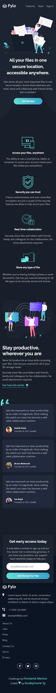
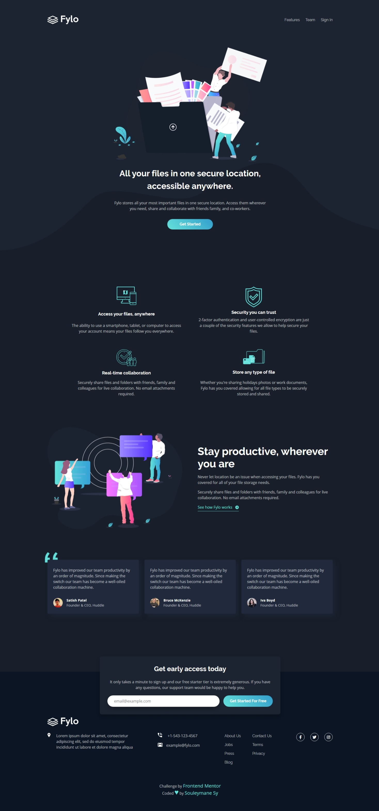

# Frontend Mentor - Fylo dark theme landing page

## Welcome! 👋

This is a solution to the [Fylo dark theme landing page challenge on Frontend Mentor](https://www.frontendmentor.io/challenges/fylo-dark-theme-landing-page-5ca5f2d21e82137ec91a50fd).

[Frontend Mentor](https://www.frontendmentor.io) challenges help you improve your coding skills by building realistic projects.

## Table of contents

- [The challenge](#the-challenge)
- [Screenshot](#screenshot)
- [Built with](#built-with)
- [Links](#links)
- [Author](#author)

## The challenge

Your challenge is to build out this landing page and get it looking as close to the design as possible.

Your users should be able to:

- View the optimal layout for the site depending on their device's screen size
- See hover states for all interactive elements on the page

## Screenshot

This is the Screenshot of my work!

### Mobile

### Mobile Form Errors

### Mobile Form Succes

### Desktop

### Desktop Form Errors

### Desktop Form Succes

### Built with

- Semantic HTML5 markup
- SASS
- CSS custom properties
- CSS Grid
- Flexbox
- Mobile-first workflow
- Yarn
- Vite
- [Vue JS 3](https://vuejs.org/) - JS Framework
- Composition API

### Links

- Solution URL: [Add solution URL here](https://your-solution-url.com)
- Live Site URL: [Add live site URL here](https://your-live-site-url.com)

## Author

- GitHub - [Souleymane Sy](https://github.com/SouleymaneSy7)
- Frontend Mentor - [@SouleymaneSy7](https://www.frontendmentor.io/profile/SouleymaneSy7)
- Twitter - [@Souleymanesy43](https://twitter.com/Souleymanesy43)
